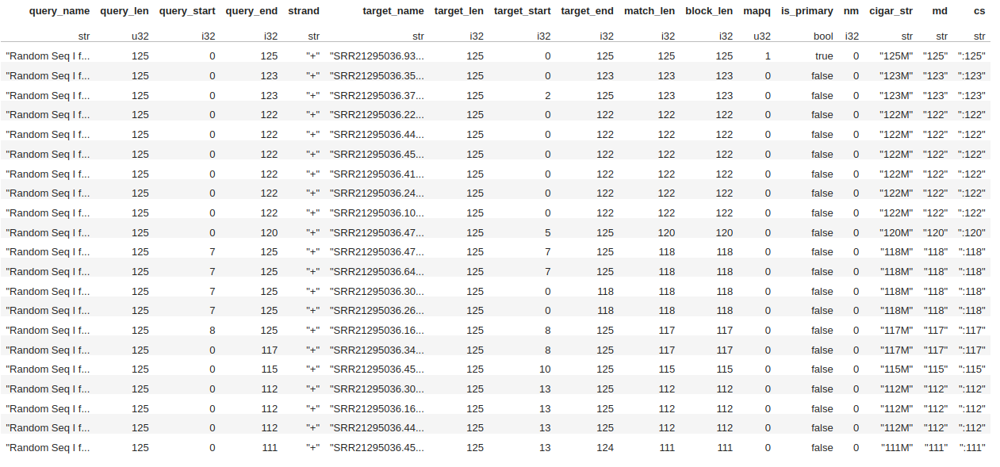

Python bindings for the [Rust FFI](https://github.com/jguhlin/minimap2-rs/) [minimap2](https://github.com/lh3/minimap2/) library. In development! Feedback appreciated!

# Why?
[PyO3](https://github.com/PyO3/pyo3) makes it very easy to create Python libraries via Rust. Further, we can use [Polars](https://github.com/pola-rs/polars) to export results as a dataframe (which can be used as-is, or converted to Pandas). Python allows for faster experimentation with novel algorithms, integration into machine learning pipelines, and provides an opportunity for those not familiar with Rust nor C/C++ to use minimap2.

## Why mininmappers2?
Because I'm terrible with names. MinimappeRS2, add RS for rust into the name. ¯\_(ツ)_/¯

# Current State
Very early alpha. Please use, and open an issue for any features you need that are missing, and for any bugs you find.

# How to use
## Requirements
Polars and PyArrow, these should be installed when you install minimappers2

## Creating an Aligner Instance
```python
aligner = map_ont()
aligner.threads(4)
```

If you want an alignment performed, rather than just matches, enable .cigar() 
```python
aligner = map_hifi()
aligner.cigar()
```

## Creating an index
```python
aligner.index("ref.fa")
```

To save a built-index, for future processing use:
```python
aligner.index_and_save("ref.fa", "ref.mmi")
```

Then next time you use the index will be faster if you use the saved index instead.
```python
aligner.load_index("ref.mmi")
```

## Aligning a Single Sequence
```python
aligner.align(seq_name, seq)
```

Where seq_name and seq are both strings. The output is a Polars DataFrame.

## Aligning Multiple Sequences
TBD

# Resuls
All results are returned as [Polars](https://github.com/pola-rs/polars) dataframes.

* Polars is the fasted dataframe library in the Python Ecosystem. 
* Polars provides a nice data bridge between Rust and Python.
* You can convert Polars dataframes to Pandas dataframes with [.to_pandas()](https://pola-rs.github.io/polars/py-polars/html/reference/dataframe/api/polars.DataFrame.to_pandas.html#polars.DataFrame.to_pandas)

Reading large files via Polars then converting to Pandas is faster than reading directly in Pandas.

For more information, please see the [Polars User Guide](https://pola-rs.github.io/polars-book/user-guide/index.html) or the [Polars Guide for Pandas users](https://pola-rs.github.io/polars-book/user-guide/coming_from_pandas.html).

## Example of Results
Here is an image of the resulting dataframe


**NOTE** Mapq, Cigar, and others will not show up unless .cigar() is enabled on the aligner itself.

# Citation
You should cite the minimap2 papers if you use this in your work.

> Li, H. (2018). Minimap2: pairwise alignment for nucleotide sequences.
> *Bioinformatics*, **34**:3094-3100. [doi:10.1093/bioinformatics/bty191][doi]

and/or:

> Li, H. (2021). New strategies to improve minimap2 alignment accuracy.
> *Bioinformatics*, **37**:4572-4574. [doi:10.1093/bioinformatics/btab705][doi2]

# Changelog
## 0.1.0
* Initial Idea

# Funding

